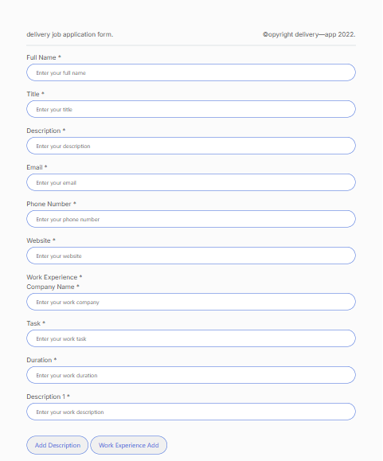
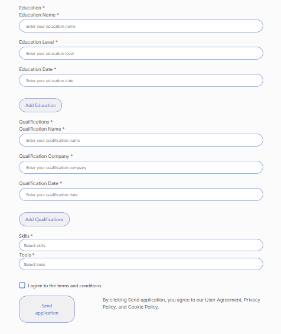
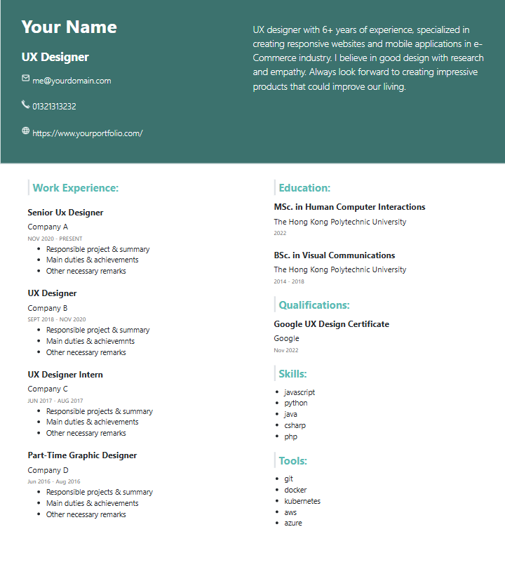
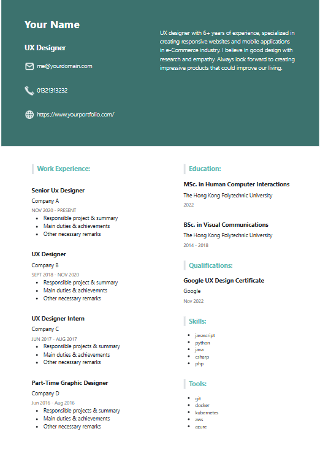

# � Professional CV Builder & Job Application Form


A modern, responsive job application form with an integrated CV generator. This project transforms form data into a professional CV layout, featuring advanced validation, custom UI components, and responsive design. The CV design is based on a professional Figma template and has been fully adapted for web and mobile responsiveness.

## 🎨 Design Source

**Original CV Design**: [Figma Community Template](https://www.figma.com/community/file/1179991498647017450)

The CV template has been carefully adapted from this Figma design and transformed into a fully responsive web layout with modern CSS/LESS styling and interactive JavaScript functionality.

## 📸 Screenshots

### 📋 Job Application Form


*Interactive job application form with validation and Select2 dropdowns*

### 📄 Professional CV Output


*Complete CV layout with all sections populated from form data*



*Mobile-optimized CV layout showing responsive design adaptation*

## 🌟 Features

## 🌟 Features

### ✨ Core Features
- **📱 Responsive Design** - Mobile-first approach with Bootstrap integration
- **📄 CV Generator** - Dynamic CV creation from form data
- **✅ Advanced Form Validation** - jQuery Validate plugin with custom rules
- **🎨 Professional CV Layout** - Based on Figma design template
- **🔍 Select2 Integration** - Enhanced dropdowns with search functionality
- **💾 Local Storage** - Form data persistence and CV data management
- **🌐 Responsive CV Design** - Mobile, tablet, and desktop optimized CV

### 🎯 CV Features
- **Work Experience** - Dynamic work history with descriptions
- **Education Background** - Educational qualifications display
- **Skills & Tools** - Comma-separated skills with responsive layout
- **Professional Qualifications** - Certifications and achievements
- **Contact Information** - Email, phone, and website integration
- **Responsive Layout** - Adapts to all screen sizes

### 🎯 Form Validation Features
- Real-time field validation
- Custom error messages in Turkish
- Email format validation
- Phone number validation (Turkish format)
- Required field checks
- Minimum/maximum length validation
- Custom error placement for Select2 elements

### 🎨 UI/UX Features
- Modern color scheme with professional design
- Smooth CSS transitions and animations
- Custom SVG icons for checkboxes
- Responsive typography with Inter font family
- Mobile-optimized interface
- Accessible form controls
- Professional CV styling with LESS/CSS

## 🚀 Demo

### 📋 Job Application Form Interface


*Interactive job application form with validation and Select2 dropdowns*

### 📄 Professional CV Output


*Complete CV layout with all sections populated from form data*


*Mobile-optimized CV layout showing responsive design adaptation*


### 📋 Application Form Features
The form collects comprehensive information:
- **Personal Details**: Full name, email, phone number, website
- **Professional Summary**: Personal description and career objectives
- **Work Experience**: Company, position, duration, and detailed descriptions
- **Education**: Institution name, degree level, and graduation dates
- **Skills & Tools**: Technical skills and software proficiency
- **Qualifications**: Certifications and professional achievements

### 📄 CV Generation Features
- **Dynamic Data Population**: Form data automatically populates CV template
- **Professional Layout**: Clean, modern design based on Figma template
- **Responsive Design**: Optimized for desktop, tablet, and mobile viewing
- **Print-Ready**: Professional formatting suitable for printing or PDF export
- **Real-time Updates**: CV updates instantly as form data changes
- **Terms Agreement**: Custom styled checkbox for terms acceptance

### Live Features
- ✅ Real-time validation feedback
- 🎨 Custom animated checkboxes
- 📱 Responsive design adaptation
- 💾 Data persistence in localStorage
- 🌐 AJAX form submission

## 📁 Project Structure

```
todolist_jquary_valıdasyon_plugin/
├── index.html                     # Job application form
├── cv.html                        # CV display page
├── assets/
│   ├── css/
│   │   ├── import.css            # Main compiled CSS
│   │   ├── import.less           # LESS imports
│   │   ├── variable.css          # CSS variables
│   │   ├── variable.less         # LESS variables
│   │   ├── form_page/           # Form-specific styles
│   │   │   ├── form.css
│   │   │   ├── form.less
│   │   │   ├── custom_checkbox.css
│   │   │   ├── custom_checkbox.less
│   │   │   ├── select2.css
│   │   │   └── select2.less
│   │   └── cv_page/             # CV-specific styles
│   │       ├── header.css
│   │       ├── header.less
│   │       ├── main.css
│   │       └── main.less
│   ├── js/
│   │   ├── script.js            # Form functionality
│   │   ├── cv.js                # CV generation logic
│   │   └── jquery.validate.js   # Validation plugin
│   ├── data/
│   │   └── data.json           # Sample data structure
│   └── images/
│       ├── icons/              # UI icons
│       └── README-IMAGES.md    # Image documentation
└── README.md                   # Project documentation
```

## 🛠️ Technologies Used

### Frontend
- **HTML5** - Semantic markup structure for form and CV
- **LESS/CSS3** - Advanced styling with modular architecture
- **JavaScript (ES6+)** - Dynamic CV generation and form handling
- **Bootstrap 5** - Responsive grid system and components

### Libraries & Frameworks
- **jQuery 3.7.1** - DOM manipulation and event handling
- **jQuery Validate** - Comprehensive form validation
- **Select2** - Enhanced multi-select dropdowns
- **LESS** - CSS preprocessing with variables and mixins

### Design & Development
- **Figma Design System** - Professional CV template adaptation
- **Mobile-First Design** - Responsive breakpoints for all devices
- **Local Storage API** - Client-side data persistence
- **Modular CSS Architecture** - Separated styles for form and CV pages

## 📋 Installation & Setup

### Prerequisites
- Modern web browser with JavaScript enabled
- Local web server (recommended for development)

### Quick Start

1. **Clone the repository**
   ```bash
   git clone https://github.com/Atarapa0/jquary-Job-application-form-to-push-cv.git
   cd jquary-Job-application-form-to-push-cv
   ```

2. **Open the project**
   ```bash
   # Option 1: Direct file opening
   open index.html
   
   # Option 2: Local server (recommended)
   python -m http.server 8000
   # or
   npx serve .
   ```

3. **View in browser**
   - Form: Navigate to `http://localhost:8000` or open `index.html`
   - CV: Navigate to `http://localhost:8000/cv.html` or open `cv.html`

## 🎯 Usage

### Application Workflow

1. **Fill the Application Form** (`index.html`)
   - Complete all required fields with personal and professional information
   - Form validates input in real-time with Turkish language support
   - Data is automatically saved to localStorage

2. **View Generated CV** (`cv.html`)
   - CV is automatically populated with form data
   - Professional layout adapts to different screen sizes
   - Print-ready format for physical copies

### Form Fields

| Field | Type | Validation | Required |
|-------|------|------------|----------|
| Full Name | Text | Min 2 chars | ✅ |
| Email | Email | Valid email format | ✅ |
| Phone | Tel | Turkish phone format | ✅ |
| Website | URL | Valid URL format | ❌ |
| Description | Textarea | Professional summary | ✅ |
| Work Experience | Dynamic | Company, role, duration | ✅ |
| Education | Dynamic | Institution, degree, date | ✅ |
| Skills | Multi-Select | Comma-separated values | ✅ |
| Tools | Multi-Select | Software proficiency | ✅ |
| Qualifications | Dynamic | Certificates and achievements | ❌ |

### CV Data Structure

```javascript
// Example data structure stored in localStorage
{
  "name": "John Doe",
  "email": "john.doe@example.com",
  "phone": "0532 123 4567",
  "website": "https://johndoe.dev",
  "description": "Senior UX Designer with 5+ years experience...",
  "workExperiences": [{
    "task": "Senior UX Designer",
    "company": "Tech Company",
    "duration": "2020-2023",
    "descriptions": ["Led design team", "Created user interfaces"]
  }],
  "educationList": [{
    "name": "Computer Science",
    "level": "Bachelor's Degree",
    "date": "2016-2020"
  }],
  "skills": "JavaScript,React,Node.js,MongoDB",
  "tools": "Figma,Photoshop,VS Code",
  "qualifications": [{
    "name": "AWS Certified",
    "company": "Amazon",
    "date": "2023"
  }]
}
```
    email: true
  },
  phone: {
    required: true,
    digits: true,
    minlength: 10,
    maxlength: 11
  }
}
```

### Custom Checkbox Implementation

## 🎨 Customization

### Color Scheme & Variables
The project uses a modular LESS architecture with centralized variables:

```less
// Primary color palette defined in variable.less
@cv_header_color: #f8f9fa;     // CV header background
@cv_text_color: #333333;       // Main text color
@primary-color: #8b54ff;       // Form primary color
@secondary-color: #3b66db;     // Form secondary color
@font-family: "Inter";         // Primary typography
```

### Responsive Breakpoints
```less
// Responsive media queries
@mobile: ~"only screen and (max-width: 767px)";
@tablet: ~"only screen and (min-width: 768px) and (max-width: 1023px)";
@desktop: ~"only screen and (min-width: 1024px)";
```

### Modular Styling Architecture
- **Form Styles**: `assets/css/form_page/` - Application form styling
- **CV Styles**: `assets/css/cv_page/` - Professional CV layout
- **Global Variables**: `assets/css/variable.less` - Shared variables
- **Component Styles**: Individual LESS files for specific components

### Customizing CV Layout
Modify CV appearance by editing:
```less
// CV header styling
.header {
  background-color: @cv_header_color;
  padding: 30px 40px;
  
  &_left {
    #cv_name {
      font-size: 35px;
      font-weight: bold;
    }
  }
}

// CV content sections
.work_experiences_detail {
  margin-bottom: 15px;
  border-left: 3px solid @primary-color;
  padding-left: 15px;
}
```

## 🔧 Development Features

### LESS Compilation
The project uses modular LESS architecture:
- Automatic CSS compilation from LESS files
- Variable-based theming system
- Component-based styling approach
- Responsive design mixins

### JavaScript Modules
- **Form Handler** (`script.js`): Form validation and data collection
- **CV Generator** (`cv.js`): Dynamic CV population from localStorage
- **Validation Plugin** (`jquery.validate.js`): Extended validation rules

### Data Flow
1. **Form Input** → Validation → localStorage
2. **localStorage** → CV Generation → Dynamic HTML
3. **Responsive Display** → Print-ready output

## 🔧 Configuration

### Select2 Configuration
```javascript
$('#employmentType').select2({
  placeholder: "Select employment types",
  allowClear: true
});
```

### AJAX Submission
```javascript
$.ajax({
  url: 'https://httpbin.org/post',
  type: 'POST',
  dataType: 'json',
  data: JSON.stringify(formData),
  contentType: 'application/json'
});
```

## 🌐 Browser Support

| Browser | Version | Support |
|---------|---------|---------|
| Chrome | 60+ | ✅ Full |
| Firefox | 55+ | ✅ Full |
| Safari | 12+ | ✅ Full |
| Edge | 79+ | ✅ Full |
## 🌐 Browser Compatibility

| Browser | Version | Support |
|---------|---------|---------|
| Chrome | 90+ | ✅ Full |
| Firefox | 88+ | ✅ Full |
| Safari | 14+ | ✅ Full |
| Edge | 90+ | ✅ Full |
| IE | 11 | ⚠️ Limited |

## 📱 Mobile Responsiveness

### Responsive Design Features
- **Mobile-First Approach**: Optimized for mobile devices first
- **Breakpoints**: 
  - Mobile: `max-width: 767px`
  - Tablet: `768px - 1023px`
  - Desktop: `1024px+`
- **Touch-Friendly**: Optimized button and input sizes for mobile interaction
- **CV Layout Adaptation**: CV automatically adapts to screen sizes
- **Font Scaling**: Dynamic font sizing across devices

### CV Mobile Optimization
- Header information stacks vertically on mobile
- Work experience cards adapt to single column layout
- Contact information becomes more compact
- Print optimization remains intact across devices

## 🚀 Performance

- **Lightweight**: Minimal external dependencies
- **Fast Loading**: CDN-hosted libraries for quick loading
- **Local Storage**: Efficient client-side data management
- **Optimized CSS**: Modular LESS compilation reduces file size

## 🐛 Known Issues & Solutions

### Current Limitations
- **IE11 Compatibility**: Requires polyfills for ES6 features
- **Print Layout**: Minor adjustments needed for some printers
- **Select2 Mobile**: Styling adjustments needed for some mobile browsers

### Troubleshooting
1. **CV not displaying data**: Check browser console for localStorage errors
2. **Validation not working**: Ensure jQuery and validation plugin are loaded
3. **Responsive issues**: Verify CSS compilation from LESS files

## 🤝 Contributing

We welcome contributions! Here's how to get started:

1. **Fork the repository**
   ```bash
   git fork https://github.com/Atarapa0/jquary-Job-application-form-to-push-cv.git
   ```

2. **Create a feature branch**
   ```bash
   git checkout -b feature/cv-enhancement
   ```

3. **Make your changes**
   - Follow existing code conventions
   - Test responsive design
   - Update documentation as needed

4. **Commit and push**
   ```bash
   git commit -m "Add CV print optimization"
   git push origin feature/cv-enhancement
   ```

5. **Open a Pull Request**

### Development Guidelines
- **Code Style**: Follow existing JavaScript and LESS conventions
- **Testing**: Test across multiple browsers and devices
- **Documentation**: Update README for new features
- **Responsive Design**: Ensure all changes work on mobile devices

## 📄 License

This project is licensed under the **MIT License** - see the [LICENSE](LICENSE) file for details.

## 👨‍💻 Author

**Atarapa0** - [GitHub Profile](https://github.com/Atarapa0)

- 🌐 **Repository**: [jquary-Job-application-form-to-push-cv](https://github.com/Atarapa0/jquary-Job-application-form-to-push-cv)
- 📧 **Contact**: Available through GitHub issues

## 🙏 Acknowledgments

### Design & Inspiration
- **Original CV Template**: [Figma Community](https://www.figma.com/community/file/1179991498647017450) - Professional CV design foundation
- **Responsive Design**: Mobile-first approach implementation

### Libraries & Tools
- **[jQuery Validation Plugin](https://jqueryvalidation.org/)** - Comprehensive form validation
- **[Select2](https://select2.org/)** - Enhanced multi-select dropdowns
- **[Bootstrap](https://getbootstrap.com/)** - Responsive CSS framework
- **[LESS](https://lesscss.org/)** - CSS preprocessing
- **[Inter Font](https://fonts.google.com/specimen/Inter)** - Modern typography

## 📈 Future Enhancements

### Planned Features
- [ ] **PDF Export**: Direct CV export to PDF format
- [ ] **Multiple CV Templates**: Additional professional layouts
- [ ] **Dark Mode**: Alternative color scheme
- [ ] **Language Support**: Multi-language form and CV
- [ ] **Data Import/Export**: JSON data management
- [ ] **Print Optimization**: Enhanced print layouts
- [ ] **CV Analytics**: View and interaction tracking

### Technical Improvements
- [ ] **Progressive Web App**: Offline functionality
- [ ] **TypeScript Migration**: Enhanced type safety
- [ ] **Build Process**: Automated LESS compilation
- [ ] **Testing Suite**: Automated testing implementation

---

⭐ **Star this repository if you found it helpful!**
- [ ] PDF generation for applications
- [ ] Advanced analytics and reporting
- [ ] Dark mode theme
- [ ] Internationalization (i18n)

---

⭐ If you found this project helpful, please give it a star!

[](https://github.com/Atarapa0/Basic_jquary_validate_plugin)
[](https://github.com/Atarapa0/Basic_jquary_validate_plugin/fork)
