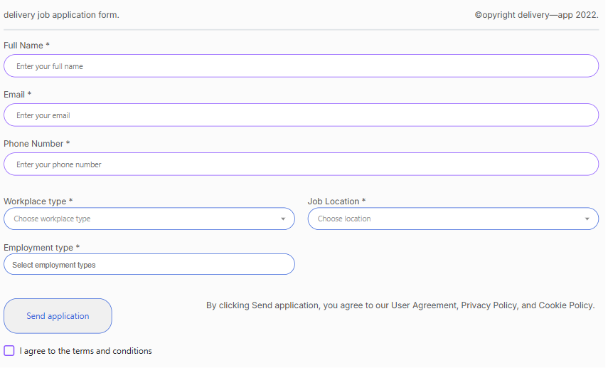

# 📝 Delivery Job Application Form


A modern, responsive job application form built with jQuery validation and custom UI components. This project demonstrates advanced form validation techniques, custom checkbox styling, and responsive design principles.

## 📸 Screenshots

(image.png)

## 🌟 Features

### ✨ Core Features
- **📱 Responsive Design** - Mobile-first approach with Bootstrap integration
- **✅ Advanced Form Validation** - jQuery Validate plugin with custom rules
- **🎨 Custom Checkbox Design** - SVG-based checkbox with smooth animations
- **🔍 Select2 Integration** - Enhanced dropdowns with search functionality
- **💾 Local Storage** - Form data persistence in browser
- **🌐 API Integration** - AJAX form submission with real-time feedback
- **📊 Data Collection** - Structured JSON data handling

### 🎯 Validation Features
- Real-time field validation
- Custom error messages in Turkish
- Email format validation
- Phone number validation (Turkish format)
- Required field checks
- Minimum/maximum length validation
- Custom error placement for Select2 elements

### 🎨 UI/UX Features
- Modern color scheme with purple accents (`#8b54ff`, `#3b66db`)
- Smooth CSS transitions and animations
- Custom SVG icons for checkboxes
- Responsive typography with Inter font family
- Mobile-optimized interface
- Accessible form controls

## 🚀 Demo


*Interactive form demonstration*

The form collects the following information:
- **Personal Details**: Full name, email, phone number
- **Job Preferences**: Workplace type, employment type, job location
- **Terms Agreement**: Custom styled checkbox for terms acceptance

### Live Features
- ✅ Real-time validation feedback
- 🎨 Custom animated checkboxes
- 📱 Responsive design adaptation
- 💾 Data persistence in localStorage
- 🌐 AJAX form submission

## 📁 Project Structure

```
todolist_jquary_valıdasyon_plugin/
├── index.html                 # Main HTML file
├── assets/
│   ├── css/
│   │   ├── style.css          # Compiled CSS
│   │   └── style.less         # LESS source files
│   ├── js/
│   │   ├── script.js          # Main JavaScript file
│   │   └── jquery.validate.js # jQuery Validation plugin
│   └── data/
│       └── data.json          # Sample data structure
└── README.md                  # Project documentation
```

## 🛠️ Technologies Used

### Frontend
- **HTML5** - Semantic markup structure
- **LESS/CSS3** - Advanced styling with preprocessor
- **JavaScript (ES5+)** - Dynamic functionality
- **Bootstrap 5** - Responsive grid system

### Libraries & Frameworks
- **jQuery 3.7.1** - DOM manipulation and AJAX
- **jQuery Validate** - Form validation
- **Select2** - Enhanced select dropdowns
- **LESS** - CSS preprocessing

### Development Tools
- **CDN Integration** - Fast loading external resources
- **Mobile-First Design** - Responsive breakpoints
- **Local Storage API** - Client-side data persistence

## 📋 Installation & Setup

### Prerequisites
- Modern web browser with JavaScript enabled
- Local web server (optional, for development)

### Quick Start

1. **Clone the repository**
   ```bash
   git clone https://github.com/Atarapa0/Basic_jquary_validate_plugin.git
   cd Basic_jquary_validate_plugin
   ```

2. **Open the project**
   ```bash
   # Option 1: Direct file opening
   open index.html
   
   # Option 2: Local server (recommended)
   python -m http.server 8000
   # or
   npx serve .
   ```

3. **View in browser**
   Navigate to `http://localhost:8000` or open `index.html` directly

## 🎯 Usage

### Form Fields

| Field | Type | Validation | Required |
|-------|------|------------|----------|
| Full Name | Text | Min 2 chars, letters only | ✅ |
| Email | Email | Valid email format | ✅ |
| Phone | Tel | 10-11 digits, Turkish format | ✅ |
| Workplace Type | Select | One selection required | ✅ |
| Employment Type | Multi-Select | At least one selection | ✅ |
| Job Location | Select | One selection required | ✅ |
| Terms Agreement | Checkbox | Must be checked | ✅ |

### Validation Rules

```javascript
// Example validation configuration
rules: {
  name: {
    required: true,
    minlength: 2
  },
  email: {
    required: true,
    email: true
  },
  phone: {
    required: true,
    digits: true,
    minlength: 10,
    maxlength: 11
  }
}
```

### Custom Checkbox Implementation

```html
<div class="custom-checkbox">
  <input type="checkbox" id="termsCheckbox" class="checkbox-input" />
  <span class="checkmark">
    <svg class="icon-checkmark">
      <use xlink:href="#icon-checkmark"></use>
    </svg>
  </span>
  <label for="termsCheckbox">I agree to the terms and conditions</label>
</div>
```

## 🎨 Customization

### Color Scheme
The project uses a consistent color palette defined in LESS variables:

```less
@primary-color: #8b54ff;    // Purple primary
@secondary-color: #3b66db;  // Blue secondary
@text-color: #565656;       // Gray text
@font-family: "Inter";      // Primary font
```

### Responsive Breakpoints
```less
@mobile: ~"only screen and (max-width: 767px)";
```

### Custom Styling
Modify `assets/css/style.less` to customize:
- Color schemes
- Typography
- Spacing and layout
- Animation timings
- Component styling

## 📊 Form Data Structure

```json
{
  "name": "Ahmet Yılmaz",
  "email": "ahmet@example.com",
  "phone": "05551234567",
  "workplaceType": "remote",
  "employmentType": ["full_time", "part_time"],
  "jobLocation": "istanbul",
  "termsCheckbox": true,
  "timestamp": "2025-08-01T10:30:00.000Z"
}
```

## 🔧 Configuration

### Select2 Configuration
```javascript
$('#employmentType').select2({
  placeholder: "Select employment types",
  allowClear: true
});
```

### AJAX Submission
```javascript
$.ajax({
  url: 'https://httpbin.org/post',
  type: 'POST',
  dataType: 'json',
  data: JSON.stringify(formData),
  contentType: 'application/json'
});
```

## 🌐 Browser Support

| Browser | Version | Support |
|---------|---------|---------|
| Chrome | 60+ | ✅ Full |
| Firefox | 55+ | ✅ Full |
| Safari | 12+ | ✅ Full |
| Edge | 79+ | ✅ Full |
| IE | 11 | ⚠️ Limited |

## 📱 Mobile Responsiveness

- **Breakpoint**: 767px and below
- **Font scaling**: Automatic size adjustment
- **Touch-friendly**: Optimized button and input sizes
- **Layout adaptation**: Stacked form elements

## 🐛 Known Issues & Limitations

- IE11 requires polyfills for some ES6 features
- Custom checkbox SVG icons need fallback for older browsers
- Select2 styling may need adjustments in some mobile browsers

## 🤝 Contributing

1. Fork the repository
2. Create a feature branch (`git checkout -b feature/amazing-feature`)
3. Commit your changes (`git commit -m 'Add amazing feature'`)
4. Push to the branch (`git push origin feature/amazing-feature`)
5. Open a Pull Request

### Development Guidelines
- Follow existing code style and conventions
- Test across multiple browsers
- Ensure mobile responsiveness
- Update documentation for new features

## 📄 License

This project is licensed under the MIT License - see the [LICENSE](LICENSE) file for details.

## 👨‍💻 Author

**Atarapa0** - [GitHub Profile](https://github.com/Atarapa0)

## 🙏 Acknowledgments

- [jQuery Validation Plugin](https://jqueryvalidation.org/) - Form validation
- [Select2](https://select2.org/) - Enhanced select boxes
- [Bootstrap](https://getbootstrap.com/) - CSS framework
- [Inter Font](https://fonts.google.com/specimen/Inter) - Typography
- [IcoMoon](https://icomoon.io/) - SVG icons

## 📈 Future Enhancements

- [ ] File upload functionality
- [ ] Multi-step form wizard
- [ ] Email notification system
- [ ] Admin dashboard for applications
- [ ] PDF generation for applications
- [ ] Advanced analytics and reporting
- [ ] Dark mode theme
- [ ] Internationalization (i18n)

---

⭐ If you found this project helpful, please give it a star!

[](https://github.com/Atarapa0/Basic_jquary_validate_plugin)
[](https://github.com/Atarapa0/Basic_jquary_validate_plugin/fork)
